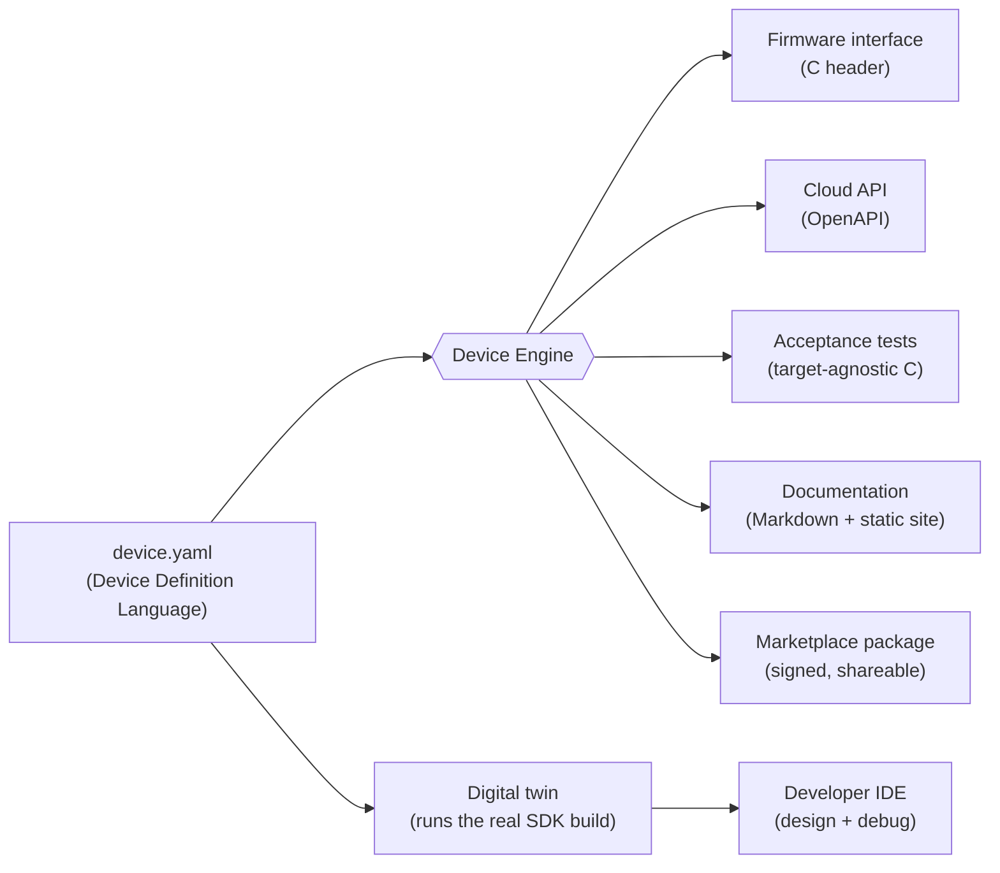

# OpenHome Studio

[](https://github.com/Diegoregalado0/openhome-studio/actions/workflows/ci.yml)
[](LICENSE)

**An open-source development platform for smart-home and IoT devices.**
You describe a device once, in plain terms — what it senses, what it controls, how it
connects, how it is powered and secured — and OpenHome Studio generates the firmware
interface, the cloud API, the tests, and the documentation, runs it as a live digital
twin, and packages it so others can install it. The goal is simple: **building a smart
device should feel as approachable as building a web app.**

---

## Table of contents

- [The idea](#the-idea)
- [How it works](#how-it-works)
- [What's inside](#whats-inside)
- [Requirements](#requirements)
- [Quickstart](#quickstart)
- [Guided tour](#guided-tour)
  - [1. Describe a device](#1-describe-a-device)
  - [2. Generate everything from it](#2-generate-everything-from-it)
  - [3. Run it as a digital twin](#3-run-it-as-a-digital-twin)
  - [4. Design and debug in the IDE](#4-design-and-debug-in-the-ide)
  - [5. Operate a fleet with the cloud](#5-operate-a-fleet-with-the-cloud)
  - [6. Share it through the marketplace](#6-share-it-through-the-marketplace)
  - [7. Work with the AI assistant](#7-work-with-the-ai-assistant)
- [Testing](#testing)
- [Hardware](#hardware)
- [Contributing](#contributing)
- [License](#license)

---

## The idea

Web development collapsed into clean, reasoned layers — App on top of Framework on top of
OS on top of Hardware — and that is largely why building for the web feels fast today.
Smart devices never got that. A single team still has to juggle firmware, cloud services,
wireless protocols, mobile apps, security, certification, and manufacturing, each with its
own tools and its own ways to drift out of sync.

OpenHome Studio inverts the problem. Instead of maintaining seven moving parts by hand,
you maintain **one** — a declarative description of the device called the **Device
Definition Language (DDL)** — and everything else is a *generated output* of it. Change
the device definition and the firmware interface, the cloud contract, the tests, and the
docs all change with it. They cannot drift, because they were never authored separately.

## How it works



The DDL is the single source of truth. The **device engine** compiles it into an
intermediate representation and runs a set of generators over it. The same definition also
drives a **digital twin** — a simulated device that runs the actual SDK build with fault
injection — so you can develop and test the whole system before any hardware exists.

## What's inside

- **Device Definition Language and compiler** — validate a device manifest and generate a
  firmware interface header, an OpenAPI cloud contract, a target-agnostic acceptance test
  suite, Markdown docs, and a self-contained static documentation site.
- **Firmware SDK and Hardware Abstraction Layer** — device lifecycle, telemetry, sensors,
  actuators, logging, and drivers, with a capability-based HAL that resolves per chip.
- **Digital twin and simulator** — a virtual device that runs the real SDK build, with
  sensor, network, and power fault injection, so behavior is verified without a board.
- **Protocol layer** — simulated Matter commissioning over a deterministic lossy transport
  that survives packet loss, plus the capability-to-Matter-cluster mapping.
- **Cloud service** — device registry, telemetry ingest, device shadow, command dispatch,
  per-device identity and certificates, firmware signing, and staged OTA with rollback.
- **Developer IDE** — a VS Code extension with a visual device designer and a live twin
  debugger, built over a shell-agnostic core so it can graduate to a standalone app later.
- **Marketplace** — signed, shareable device packages with a publish/search/install CLI
  and a networked registry service. Trust is verified on install, not assumed.
- **AI development assistant** — a provider-agnostic (bring-your-own-key) agent that
  diagnoses devices and proposes DDL edits, each verified against the real compiler before
  it is shown. Works with Anthropic, Gemini, and any OpenAI-compatible or local model, from
  the command line or an in-editor chat panel in the IDE.
- **Test framework** — a target-agnostic acceptance runner that runs the same suite on the
  twin today and on real hardware later, unchanged.

### Repository layout

| Path                 | What it is                                                       |
| -------------------- | --------------------------------------------------------------- |
| `core/device-engine` | DDL compiler, intermediate representation, and code generators  |
| `core/studio`        | Shell-agnostic IDE core: validate, generate, and drive the twin |
| `core/assistant`     | Provider-agnostic AI assistant: grounded, tool-using agent      |
| `sdk/firmware`       | Device SDK and HAL, native BSP, ESP32-C6 targets (telemetry, Matter, OTA) |
| `simulator`          | Digital-twin engine and fault injection                         |
| `protocols`          | Matter commissioning and transport simulation                   |
| `cloud`              | Registry, telemetry, shadow, commands, identity, signing, OTA   |
| `marketplace`        | Signed device-package registry, CLI, and HTTP service           |
| `apps/ide`           | Developer IDE, delivered as a VS Code extension                 |
| `tests`              | Acceptance test framework and hardware-in-the-loop harness      |
| `docs`               | Roadmap, architecture notes, and generated documentation        |
| `examples`           | Reference device definitions (start with `examples/thermostat`) |

The monorepo is a pnpm workspace. TypeScript packages build topologically
(`device-engine` first, then its consumers); the C components build with `make`.

## Requirements

- **Node.js** >= 22
- **pnpm** >= 11 (`corepack enable` will provide it)
- **A C toolchain** — `make` and a C11 compiler (`gcc` or `clang`) — for the firmware,
  simulator, protocol, and twin components. On macOS, install the Xcode Command Line
  Tools; on Debian/Ubuntu, `build-essential`.
- **Visual Studio Code** (only if you want to run the developer IDE)

## Quickstart

```sh
git clone https://github.com/Diegoregalado0/openhome-studio.git
cd openhome-studio
pnpm install

# Build every package (topological), then typecheck and run the test suites.
pnpm -r build
pnpm -r typecheck
pnpm -r test
```

That builds and tests the entire TypeScript surface. To also exercise the C components,
see [Testing](#testing).

## Guided tour

Everything below assumes you have run `pnpm -r build` at least once.

### 1. Describe a device

A device is a single YAML manifest. Here is the reference thermostat
(`examples/thermostat/device.yaml`), trimmed:

```yaml
device:
  name: smart_thermostat
  manufacturer: example
  category: thermostat

capabilities:
  temperature_sensor:
    type: sensor
    unit: celsius
    range: { min: -20, max: 50 }
  hvac:
    type: actuator
    modes: [heating, cooling, off]

connectivity:
  protocols: [matter, thread, bluetooth]

power:
  battery:
    rechargeable: true

security:
  encryption:
    enabled: true
```

Validate it at any time:

```sh
node core/device-engine/dist/cli.js validate examples/thermostat/device.yaml
```

### 2. Generate everything from it

```sh
node core/device-engine/dist/cli.js compile examples/thermostat/device.yaml --out build/generated
```

From that one manifest you get, under `build/generated`:

```
firmware/smart_thermostat_interface.h        # firmware interface (C header)
cloud/smart_thermostat.openapi.json          # cloud API contract (OpenAPI)
tests/smart_thermostat_generated.c           # target-agnostic acceptance tests
docs/smart_thermostat.md                     # reference documentation
docs/site/smart_thermostat/index.html        # self-contained static docs site
docs/site/smart_thermostat/capabilities.html
docs/site/smart_thermostat/telemetry.html
docs/site/smart_thermostat/styles.css
```

Change the manifest and re-run: every one of these outputs changes with it.

### 3. Run it as a digital twin

The twin runs the actual SDK build as a simulated device and streams telemetry as
newline-delimited JSON. It accepts fault injection so you can see how the device behaves
when a sensor sticks, fails, or drifts:

```sh
make -C simulator/examples/twin_studio
./simulator/examples/twin_studio/build/twin_studio \
  --ticks 10 --interval-ms 200 --fault stuck --fault-at 5
```

You can also run the higher-level demonstrations:

```sh
make -C sdk/firmware/examples/thermostat run   # reference firmware, logging telemetry
make -C simulator example                      # twin across fault scenarios
make -C protocols example                      # Matter commissioning across packet loss
```

### 4. Design and debug in the IDE

The developer IDE is a VS Code extension: a visual designer that reads and writes the DDL,
and a live twin debugger with a telemetry chart and fault controls.

```sh
pnpm -r build
```

Then, to launch it in an Extension Development Host:

1. Open this repository in VS Code.
2. Create `.vscode/launch.json` with the following (this file is intentionally not
   committed, so each contributor points it at their own checkout):

   ```json
   {
     "version": "0.2.0",
     "configurations": [
       {
         "name": "Run OpenHome Studio",
         "type": "extensionHost",
         "request": "launch",
         "args": [
           "--extensionDevelopmentPath=${workspaceFolder}/apps/ide",
           "${workspaceFolder}"
         ]
       }
     ]
   }
   ```

3. Press **F5**. A second VS Code window opens with the extension loaded. Open the
   **OpenHome Studio** view in the activity bar to see your devices, open the visual
   designer, and debug a twin. After editing the extension, reload that window to pick up
   changes.

### 5. Operate a fleet with the cloud

The cloud service is a dependency-free registry, telemetry shadow, command queue, device
identity authority, firmware signer, and staged OTA controller.

```sh
PORT=8080 pnpm --filter @openhome/cloud serve
```

It exposes a small HTTP API (register devices, ingest telemetry, read the shadow, queue
commands, provision signed identities, publish signed firmware, and drive rollouts). See
[`cloud/README.md`](cloud/README.md) for the full route list.

### 6. Share it through the marketplace

The marketplace is the App Store for device definitions: a package bundles the DDL
manifest with its drivers, tests, and docs, is signed by its publisher, and is verified
again on install. It works against a local registry directory or a networked service.

**Locally:**

```sh
# Package and publish the thermostat into your local registry (~/.openhome by default).
mkdir -p /tmp/mydev && cp examples/thermostat/device.yaml /tmp/mydev/
printf '{"name":"my.thermostat","version":"1.0.0","description":"my thermostat","author":"me","keywords":["hvac"]}\n' \
  > /tmp/mydev/openhome.package.json

node marketplace/dist/cli.js publish /tmp/mydev
node marketplace/dist/cli.js search hvac
node marketplace/dist/cli.js install my.thermostat --dir /tmp/installed
```

**Over the network** — run a registry service, then point the CLI at it:

```sh
# Terminal A
PORT=8080 pnpm --filter @openhome/marketplace serve

# Terminal B
export OPENHOME_REGISTRY_URL=http://localhost:8080
node marketplace/dist/cli.js publish /tmp/mydev
node marketplace/dist/cli.js install my.thermostat --dir /tmp/installed
```

Installing re-verifies the package's signature and re-validates its manifest before
writing a single file, so trust never depends on the transport. See
[`marketplace/README.md`](marketplace/README.md) for details.

### 7. Work with the AI assistant

The assistant is a tool-using agent that diagnoses devices and proposes DDL edits. It is
provider-agnostic — bring your own API key for Anthropic, Gemini, any OpenAI-compatible
endpoint, or a local model — and its suggestions are grounded: a proposal is checked
against the real compiler before you ever see it, and applying it is an explicit step.

```sh
export OPENHOME_LLM_PROVIDER=anthropic       # or gemini, or openai-compatible
export OPENHOME_LLM_API_KEY=sk-...

node core/assistant/dist/cli.js ask \
  "add a humidity sensor and make it battery powered" \
  --device examples/thermostat/device.yaml
# review the printed diff, then re-run with --apply to write it
```

To use a fully local, keyless model, point the OpenAI-compatible provider at it:

```sh
export OPENHOME_LLM_PROVIDER=openai-compatible
export OPENHOME_LLM_BASE_URL=http://localhost:11434/v1   # e.g. Ollama
export OPENHOME_LLM_MODEL=llama3.1
node core/assistant/dist/cli.js ask "explain what this device does" \
  --device examples/thermostat/device.yaml
```

Your prompt and manifest are sent only to the endpoint you configure. See
[`core/assistant/README.md`](core/assistant/README.md) for details.

The same assistant is available inside the IDE: run **Open AI Assistant** from the Devices
view for a chat panel that shows proposals as a diff and applies them on click. Configure
the provider and model under the `openhome.assistant` settings; the API key is stored in VS
Code secret storage.

## Testing

**TypeScript** (registry, cloud, IDE core, device engine):

```sh
pnpm -r test
```

**C components** (firmware, simulator, protocols, and the acceptance suites):

```sh
make -C sdk/firmware/tests run     # SDK and HAL unit tests
make -C simulator/tests run        # twin runtime unit tests
make -C protocols/tests run        # transport and Matter unit tests
make -C tests test                 # end-to-end acceptance suites (uses the device engine)
```

Continuous integration runs all of the above on every push and pull request, plus the
ESP32 BSP host-compile check and the twin smoke test. See
[`.github/workflows/ci.yml`](.github/workflows/ci.yml).

## Hardware

The platform is twin-first — everything above runs and is tested without a board — but it is
also proven on real silicon (ESP32-C6):

- **Telemetry firmware** — the manifest-generated firmware runs on the chip and streams live
  temperature from its on-die sensor, over the same `manifest -> generated interface -> SDK +
  HAL` path the twin uses. Project: [`sdk/firmware/targets/esp32c6`](sdk/firmware/targets/esp32c6).
- **Hardware-in-the-loop testing** — the same acceptance suite runs against the twin *and* the
  physical board over its serial console, unchanged, by setting `OPENHOME_HIL_PORT`. It reads
  the telemetry stream for sensors and sends commands (confirmed by the firmware) to drive the
  HVAC actuator on a real GPIO (see [`tests`](tests)).
- **Real Matter** — a Matter-over-Wi-Fi build (connectedhomeip / esp-matter) exposing a
  Temperature Measurement cluster fed by the on-die sensor. It **commissions onto a Matter
  fabric** and a controller **reads the live temperature back** over the fabric (verified with
  chip-tool) — the DDL device as a real Matter node. Project and setup:
  [`sdk/firmware/targets/esp32c6-matter`](sdk/firmware/targets/esp32c6-matter).
- **Signed over-the-air updates** — the device polls the cloud, downloads the newest build,
  verifies its SHA-256 and the cloud's Ed25519 signature against a baked-in key, and switches to
  it; a bad image fails its self-test and the bootloader rolls back. This runs the platform's
  own signed-build pipeline through to a chip. Project:
  [`sdk/firmware/targets/esp32c6-ota`](sdk/firmware/targets/esp32c6-ota).

```sh
# telemetry
idf.py -C sdk/firmware/targets/esp32c6 set-target esp32c6 build flash monitor
# HIL: run the acceptance suite against the board (sensors and actuator)
OPENHOME_HIL_PORT=/dev/tty.usbmodem1401 make -C tests/suites/thermostat run
```

Still ahead: a physical HIL rack (a board farm and electrical instruments), secure boot, and
factory-provisioned per-device certificates. The on-die sensor reads at ~1&nbsp;°C resolution;
an external I2C sensor is the path to finer room-temperature readings. Consumer ecosystems
(Apple/Google/Alexa) require a hub and a certified device; chip-tool needs neither.

## Contributing

Contributions are welcome. Please read [CONTRIBUTING.md](CONTRIBUTING.md) before opening a
pull request. In short: keep changes small and reviewable, add or update tests alongside
behavior changes, and run `pnpm -r typecheck` and `pnpm -r test` before pushing.

## License

MIT. See [LICENSE](LICENSE).
