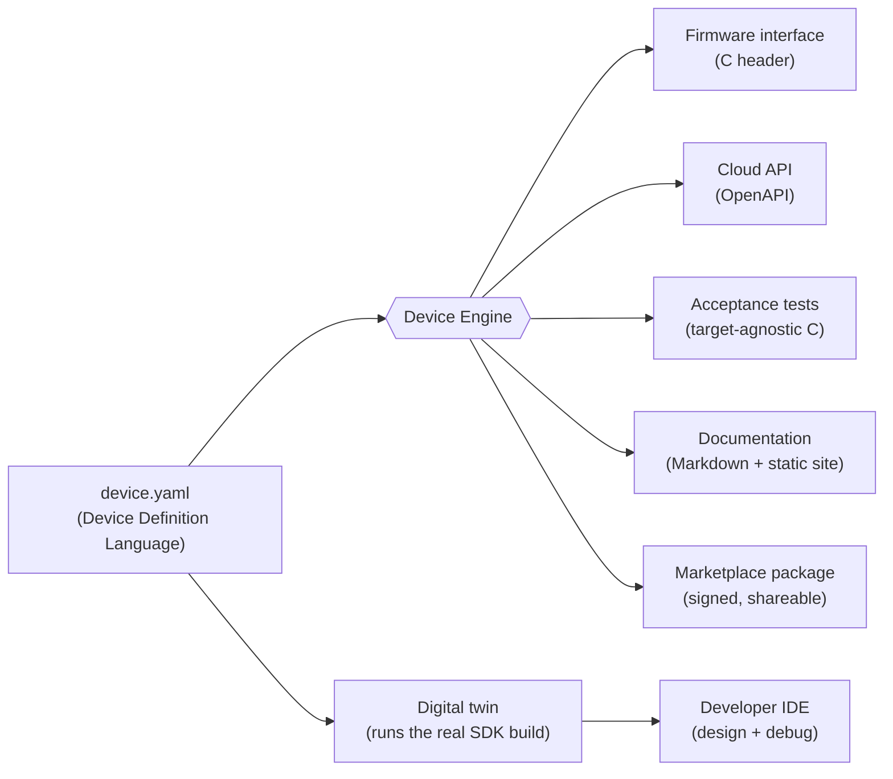

# OpenHome Studio

[](https://github.com/Diegoregalado0/openhome-studio/actions/workflows/ci.yml)
[](LICENSING.md)

**Build a production smart device from a single definition — and it's free.**

Describe your device once, in plain terms — what it senses, what it controls, how it connects,
how it is powered and secured — and OpenHome Studio gives you the firmware interface, the cloud
API, the tests, and the documentation, runs it as a live digital twin before you own any
hardware, delivers signed over-the-air updates to the real chip, and packages it so others can
install it. Building a smart device should feel as approachable as building a web app.

```yaml
device:
  name: smart_thermostat
  category: thermostat
capabilities:
  temperature_sensor: { type: sensor, unit: celsius, range: { min: -20, max: 50 } }
  hvac:               { type: actuator, modes: [heating, cooling, off] }
connectivity: { protocols: [matter, thread, bluetooth] }
```

That one file becomes a C firmware interface, an OpenAPI cloud contract, a runnable acceptance
test suite, reference docs and a docs site, a Matter device, and a signed, shareable package —
all of which stay in lockstep because they are generated, never authored separately.

---

## Table of contents

- [Why](#why)
- [What you get](#what-you-get)
- [Quickstart](#quickstart)
- [Guided tour](#guided-tour)
- [Run it on real hardware](#run-it-on-real-hardware)
- [How the pieces fit](#how-the-pieces-fit)
- [The three layers](#the-three-layers)
- [Extend it with your hardware](#extend-it-with-your-hardware)
- [Reference](#reference)
- [Licensing](#licensing)

---

## Why

Web development collapsed into clean, reasoned layers — App on Framework on OS on Hardware —
and that is largely why building for the web feels fast. Smart devices never got that. One team
still juggles firmware, cloud services, wireless protocols, mobile apps, security, and
certification, each with its own tools and its own ways to drift out of sync.

OpenHome Studio inverts the problem. Instead of maintaining seven moving parts by hand, you
maintain **one** — a declarative **Device Definition Language (DDL)** — and everything else is a
*generated output* of it. Change the definition and the firmware interface, the cloud contract,
the tests, and the docs all change with it. They cannot drift, because they were never authored
separately.

## What you get

- **One definition, many outputs** — validate a device manifest and generate a firmware
  interface header, an OpenAPI cloud contract, a target-agnostic acceptance suite, Markdown
  docs, and a self-contained static docs site.
- **A digital twin** — a simulated device that runs the *actual* SDK build, with sensor,
  network, and power fault injection, so you develop and test the whole system before any board
  exists.
- **A developer IDE** — a VS Code extension with a visual device designer and a live twin
  debugger (telemetry chart, fault controls).
- **A cloud service** — device registry, telemetry ingest, device shadow, command dispatch,
  per-device identity and certificates, firmware signing, and staged OTA with rollback.
- **Signed over-the-air updates** — proven end to end on real silicon: the device verifies a
  cloud-signed image and applies it, with automatic rollback if it fails to boot.
- **A marketplace** — signed, shareable device packages with a publish/search/install CLI and a
  networked registry. Trust is verified on install, not assumed.
- **An AI assistant** — a bring-your-own-key agent that diagnoses devices and proposes DDL
  edits, each checked against the real compiler before you see it. Works with Anthropic, Gemini,
  any OpenAI-compatible endpoint, or a local model, from the CLI or an in-editor chat panel.
- **Real hardware, twin-first** — the same acceptance suite runs against the twin and against a
  physical ESP32-C6 unchanged; the device also commissions onto a real Matter fabric.

## Quickstart

Requirements: **Node.js >= 22**, **pnpm >= 11** (`corepack enable`), and a **C toolchain**
(`make` + `gcc`/`clang`; Xcode Command Line Tools on macOS, `build-essential` on Debian/Ubuntu).

```sh
git clone https://github.com/Diegoregalado0/openhome-studio.git
cd openhome-studio
pnpm install
pnpm -r build        # build every package (topological)
pnpm -r test         # run the TypeScript test suites
```

Then generate everything from the reference device:

```sh
node core/device-engine/dist/cli.js compile examples/thermostat/device.yaml --out build/generated
```

## Guided tour

Everything below assumes you have run `pnpm -r build` at least once.

### 1. Describe a device

A device is a single YAML manifest — see the full reference in
[`examples/thermostat/device.yaml`](examples/thermostat/device.yaml). Validate it any time:

```sh
node core/device-engine/dist/cli.js validate examples/thermostat/device.yaml
```

### 2. Generate everything from it

```sh
node core/device-engine/dist/cli.js compile examples/thermostat/device.yaml --out build/generated
```

From that one manifest you get, under `build/generated`:

```
firmware/smart_thermostat_interface.h        # firmware interface (C header)
cloud/smart_thermostat.openapi.json          # cloud API contract (OpenAPI)
tests/smart_thermostat_generated.c           # target-agnostic acceptance tests
docs/smart_thermostat.md                     # reference documentation
docs/site/smart_thermostat/index.html        # self-contained static docs site
```

Change the manifest and re-run: every output changes with it.

### 3. Run it as a digital twin

The twin runs the actual SDK build as a simulated device and streams telemetry as
newline-delimited JSON, with fault injection so you can see how it behaves when a sensor
sticks, fails, or drifts:

```sh
make -C simulator/examples/twin_studio
./simulator/examples/twin_studio/build/twin_studio \
  --ticks 10 --interval-ms 200 --fault stuck --fault-at 5
```

### 4. Design and debug in the IDE

The developer IDE is a VS Code extension: a visual designer that reads and writes the DDL, and a
live twin debugger with a telemetry chart and fault controls.

1. Open this repository in VS Code.
2. Create `.vscode/launch.json` (intentionally not committed, so each person points it at their
   own checkout):

   ```json
   {
     "version": "0.2.0",
     "configurations": [
       {
         "name": "Run OpenHome Studio",
         "type": "extensionHost",
         "request": "launch",
         "args": [
           "--extensionDevelopmentPath=${workspaceFolder}/apps/ide",
           "${workspaceFolder}"
         ]
       }
     ]
   }
   ```

3. Press **F5**, then open the **OpenHome Studio** view in the activity bar to design a device
   and debug its twin.

### 5. Operate a fleet with the cloud

```sh
PORT=8080 pnpm --filter @openhome/cloud serve
```

A dependency-free registry, telemetry shadow, command queue, identity authority, firmware
signer, and staged-OTA controller over a small HTTP API. See
[`cloud/README.md`](cloud/README.md) for the routes.

### 6. Ship a signed update to a device

The cloud signs firmware; the device verifies and applies it, and rolls back a bad image
automatically. Establish a signing identity, publish a build, and the device self-updates:

```sh
pnpm --filter @openhome/cloud firmware keygen ~/.openhome/firmware-signing.key
pnpm --filter @openhome/cloud firmware publish ~/.openhome/firmware-signing.key \
  smart_thermostat 1.0.1 path/to/firmware.bin http://<host-ip>:8091
```

The full on-device flow (verification, partition switch, rollback) is in
[`sdk/firmware/targets/esp32c6-ota`](sdk/firmware/targets/esp32c6-ota).

### 7. Share it through the marketplace

The marketplace is the App Store for device definitions: a package bundles the manifest with its
drivers, tests, and docs, is signed by its publisher, and is re-verified on install.

```sh
node marketplace/dist/cli.js publish /path/to/mydev
node marketplace/dist/cli.js search hvac
node marketplace/dist/cli.js install my.thermostat --dir /tmp/installed
```

Installing re-verifies the signature and re-validates the manifest before writing a single file,
so trust never depends on the transport. See [`marketplace/README.md`](marketplace/README.md).

### 8. Work with the AI assistant

Bring your own key. Proposals are grounded — checked against the real compiler before you see
them — and applying one is an explicit step.

```sh
export OPENHOME_LLM_PROVIDER=anthropic       # or gemini, or openai-compatible
export OPENHOME_LLM_API_KEY=sk-...
node core/assistant/dist/cli.js ask \
  "add a humidity sensor and make it battery powered" \
  --device examples/thermostat/device.yaml
# review the printed diff, then re-run with --apply to write it
```

Point the OpenAI-compatible provider at a local model (e.g. Ollama) for a fully keyless setup.
The same assistant runs inside the IDE as a chat panel. Your prompt and manifest are sent only
to the endpoint you configure. See [`core/assistant/README.md`](core/assistant/README.md).

## Run it on real hardware

The platform is twin-first — everything above runs and is tested without a board — and it is
also proven on real silicon (ESP32-C6):

- **Telemetry firmware** — the manifest-generated firmware streams live temperature from the
  chip's on-die sensor, over the same `manifest -> generated interface -> SDK + HAL` path the
  twin uses. [`sdk/firmware/targets/esp32c6`](sdk/firmware/targets/esp32c6).
- **Hardware-in-the-loop testing** — the same acceptance suite runs against the twin *and* the
  physical board over its serial console, unchanged, via `OPENHOME_HIL_PORT`. It reads telemetry
  for sensors and sends commands (confirmed by the firmware) to drive the HVAC actuator on a
  real GPIO.
- **Real Matter** — a Matter-over-Wi-Fi build that commissions onto a Matter fabric, and a
  controller reads the live temperature back over the fabric (verified with chip-tool).
  [`sdk/firmware/targets/esp32c6-matter`](sdk/firmware/targets/esp32c6-matter).
- **Signed OTA** — the device verifies a cloud-signed image (SHA-256 + Ed25519 against a
  baked-in key), applies it, and the bootloader rolls back a build that fails its self-test.
  [`sdk/firmware/targets/esp32c6-ota`](sdk/firmware/targets/esp32c6-ota).

```sh
# telemetry
idf.py -C sdk/firmware/targets/esp32c6 set-target esp32c6 build flash monitor
# HIL: run the acceptance suite against the board (sensors and actuator)
OPENHOME_HIL_PORT=/dev/tty.usbmodem1401 make -C tests/suites/thermostat run
```

Want a chip that isn't supported yet? That is exactly the contribution the project invites —
see [Extend it with your hardware](#extend-it-with-your-hardware).

## How the pieces fit



The DDL is the single source of truth. The **device engine** compiles it into an intermediate
representation and runs generators over it; the same definition also drives the **digital twin**
that runs the real SDK build with fault injection.

## The three layers

OpenHome Studio is designed around three layers, which is also how the licensing and the
contribution model divide up:

| Layer | What it is | Who owns it | License |
|-------|-----------|-------------|---------|
| **Service** | The platform you build on: the DDL and compiler, generators, twin, cloud, marketplace, assistant, and IDE | Developed by the maintainers, free to use | [Elastic License 2.0](LICENSE) |
| **Silicon** | Board support: the HAL interface, the BSPs that implement it per chip, and the device SDK | **Openly contributed by the community** | [Apache-2.0](sdk/firmware/LICENSE) |
| **Content** | Device definitions you write and share | **You** | Yours |

You use the service for free. You extend the silicon layer with new chips. You own and share the
device definitions you create. See [LICENSING.md](LICENSING.md) for the full breakdown.

## Extend it with your hardware

The reference ESP32-C6 support was built the same way anyone can add a chip: implement the
Hardware Abstraction Layer for it. The firmware tree is Apache-2.0 precisely so board support can
be contributed, shipped, and relicensed without friction — this is the layer we most want the
community to grow.

- **Add a board:** [docs/adding-a-board.md](docs/adding-a-board.md) — a step-by-step walkthrough
  using the ESP32-C6 BSP as the worked reference.
- **Contribution model and setup:** [CONTRIBUTING.md](CONTRIBUTING.md).

Publishing device definitions through the [marketplace](marketplace/README.md) is the other way
to contribute — as content, without changing the platform.

## Reference

### Repository layout

| Path | What it is | License |
| ---- | ---------- | ------- |
| `core/device-engine` | DDL compiler, IR, and code generators | Elastic-2.0 |
| `core/studio` | Shell-agnostic IDE core: validate, generate, drive the twin | Elastic-2.0 |
| `core/assistant` | Provider-agnostic AI assistant: grounded, tool-using agent | Elastic-2.0 |
| `sdk/firmware` | Device SDK, HAL, native BSP, ESP32-C6 targets (telemetry, Matter, OTA) | **Apache-2.0** |
| `simulator` | Digital-twin engine and fault injection | Elastic-2.0 |
| `protocols` | Matter commissioning and transport simulation | Elastic-2.0 |
| `cloud` | Registry, telemetry, shadow, commands, identity, signing, OTA | Elastic-2.0 |
| `marketplace` | Signed device-package registry, CLI, and HTTP service | Elastic-2.0 |
| `apps/ide` | Developer IDE, delivered as a VS Code extension | Elastic-2.0 |
| `tests` | Acceptance framework and hardware-in-the-loop harness | Elastic-2.0 |
| `examples` | Reference device definitions (start with `examples/thermostat`) | Elastic-2.0 |

The monorepo is a pnpm workspace. TypeScript packages build topologically (`device-engine`
first); the C components build with `make`.

### Testing

```sh
pnpm -r test                       # TypeScript: device engine, cloud, IDE core, marketplace, assistant
make -C sdk/firmware/tests run     # SDK and HAL unit tests
make -C simulator/tests run        # twin runtime unit tests
make -C protocols/tests run        # transport and Matter unit tests
make -C tests test                 # end-to-end acceptance suites (uses the device engine)
```

CI runs all of the above on every push and pull request, plus the ESP32 BSP host-compile check
and the twin smoke test. See [`.github/workflows/ci.yml`](.github/workflows/ci.yml).

## Licensing

OpenHome Studio is **free to use**, split across two licenses along a deliberate line:

- The **service** (everything except `sdk/firmware/`) is under the
  [Elastic License 2.0](LICENSE): use, modify, and self-host freely; do not offer it to others
  as a hosted or managed service.
- The **hardware layer** ([`sdk/firmware/`](sdk/firmware/)) is under
  [Apache-2.0](sdk/firmware/LICENSE), so board support can be contributed and shipped freely.

Your device definitions are your own content. Full details in [LICENSING.md](LICENSING.md).
